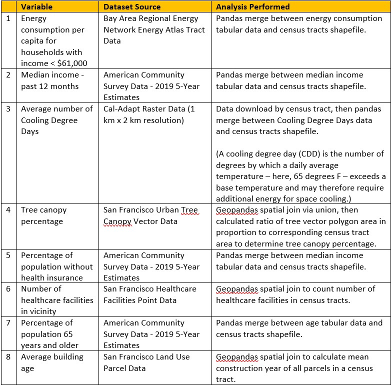
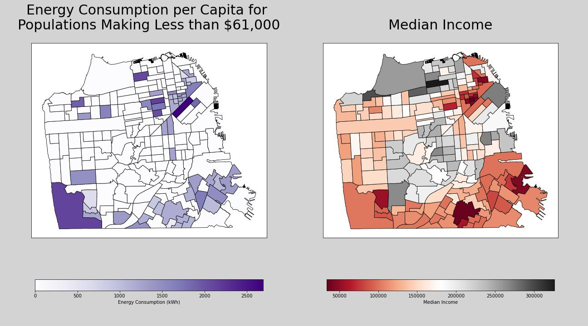
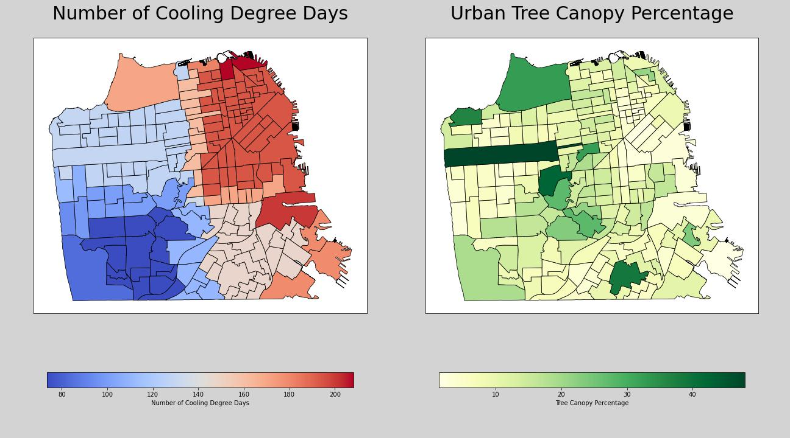
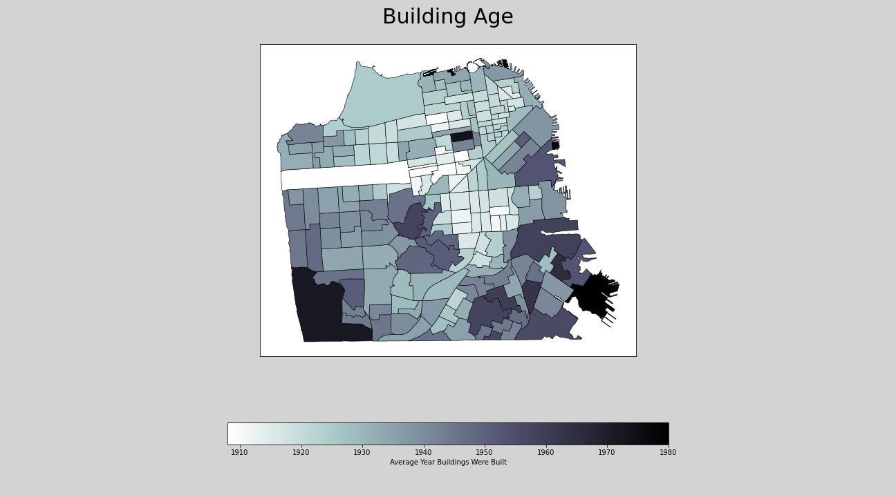
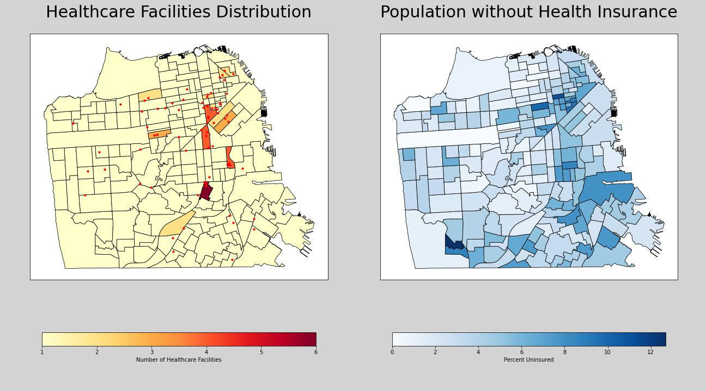
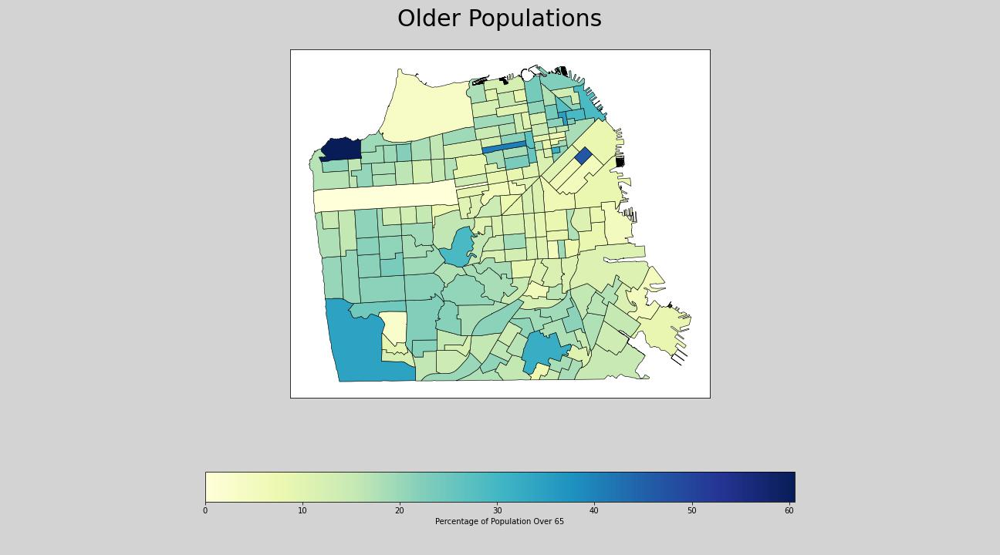

### **Building an Energy Vulnerability Index for San Francisco**

May 9th, 2022

For this project I constructed an Energy Vulnerability Index (EVI) for San Francisco to evaluate the vulnerability of neighborhoods to the impacts of high electricity utility bills, power disconnections and energy grid shutoffs. An energy vulnerability index will produce a spatial representation of community vulnerability to energy systems, a particularly important consideration in the context of a rapidly changing climate. With the transition to an electric grid powered by renewable energy, the price of the energy commodity is projected to decrease. One purpose of a complete EVI is to help identify which communities will benefit the most from the implementation of a 100% renewable energy electricity grid and a more affordable energy commodity. 

## METHODOLOGY

The EVI was built using eight different variables to determine an area’s energy vulnerability. The variables were selected by their role in 1) exposure to risk 2) sensitivity and 3) adaptive capacity. In climate vulnerability analysis, broadly defined, exposure to risk, sensitivity, and adaptive capacity are defined using the following:

-	Exposure to risk: The degree to which a community is exposed to climatic variations.
-	Sensitivity: The degree to which a community is affected by climate variations.
-	Adaptive Capacity: The ability of a community to adjust and moderate damage.

After reviewing existing vulnerability literature and evaluating existing datasets, I used exposure to risk, sensitivity, and adaptive capacity to select eight variables to assess overall energy vulnerability. Each variable required one dataset. Eight datasets for the eight different variables were identified to calculate the final EVI. All eight datasets for variables included in the index required geospatial and statistical manipulation, the processes for which are further outlined in the table below. Further research could interrogate all available variables and datasets with more rigor to build the best possible index for energy vulnerability in San Francisco. 

The eight variables, accompanying datasets, and geospatial and statistical analysis are described in the table below: 

All data was normalized spatially at the census tract level in order to establish a single unit of spatial analysis. 

The data for each variable was also normalized between a scale of 0-1 to ensure equal weighting for each variable in the index. The formula to normalize the data for each dataset is as follows:

When high values represent greater vulnerability: y = (x-min)/(max-min)

When low values represent greater vulnerability: y = (max-x)/(max-min)

To combine the resulting values into the final EVI, a formula was used to add all individual normalized variables together and divide by the total number of variables. The formula is as follows:

(Variable1 + Variable2 + Variable3 + Variable4 + Variable5 + Variable6 + Variable7 + Variable8) / n

  
## VARIABLES – MAPS AND BACKGROUND

It is well known that low-income families face high electric utility costs, for example disproportionately high energy burdens. Energy burden is defined by the percentage of a household’s gross income spent on energy costs. According to the Department of Energy’s Low-Income Energy Affordability Data Tool, the national average energy burden for low-income households is 8.6%, approximately three times higher than for non-low-income households. In some areas, depending on location and income, the energy burden can be as high as 30% of household gross income. Households with high energy burdens have also been found to be at greater risk for respiratory diseases, suffer from increased stress and economic hardship, and find it harder to escape poverty.

Extreme heat can compound the effects of energy vulnerability for households. Heat waves and their impacts are well known to be distributed unevenly across several U.S. cities, including San Francisco. An analysis by the San Francisco Department of Public Health found that overburdened neighborhoods likely face the greatest challenges from heat waves, excess stress on the grid, and increased health vulnerabilities. Additionally, as the frequency of Cooling Degree Days increases, those with high rates of power disconnection will face significant risk if they are unable to afford the costs of cooling. A Cooling Degree Day (CDD) is the number of degrees by which a daily average temperature exceeds a base temperature and may therefore require additional energy for space cooling. Increasingly high demand for cooling to prevent health disasters from high heat exposure will further exacerbate energy cost burdens, an impact largely experienced by low-income communities.

Energy codes and standards set minimum efficiency requirements for new and renovated buildings, assuring lower utility bills and optimized energy use for heating and cooling. A building's operation and environmental impact is largely determined by upfront decisions during new construction and renovation. Determining a building’s age can provide insight into the recency of its construction. If a building was constructed many years ago, it is far less likely to have incorporated the energy efficiency building practices required by today’s building codes. This means less efficient building heating and cooling and an overall higher energy burden through more expensive utility bills for local residents. 

Power outages and grid shutoffs also create an uneven distribution of impacts for populations with underlying health conditions. Understanding the distribution of healthcare facilities and populations without health insurance can help ensure that vulnerable populations reliant on electrical equipment for their mobility, managing medical needs (oxygen, dialysis, asthma nebulizers, refrigeration of medication, etc), and more are not left without critical medical support.

Older adults face high risk to climate hazards such as heat, cold, earthquake, and wildfires because they are more likely to have chronic physical or cognitive health conditions. For example, with heat, older populations face higher risk to dehydration, heat stroke, and other heat-related illnesses. Older adults are also more vulnerable to power disruptions because they are more likely to rely on electrical equipment for everyday medical support. 

## FINAL THOUGHTS

An Energy Vulnerability Index gives us the information we need to understand the distribution of communities vulnerable to high energy burdens, power disconnections, and power disruptions as a result of natural climate hazards. The transition to a renewable-energy powered electricity grid is an opportunity to utilize new technologies to support historically disadvantaged communities. With a tool like this, San Francisco can identify the communities that need the most support and will benefit the most from interventions such as solar and wind-sourced electricity, battery storage facilities, micro-grids, and the numerous other technologies that are transforming our local energy systems today.

## CITATIONS

1. Cal-Adapt. (2021). Cooling Degree Days and Heating Degree Days. Cal-Adapt. https://cal-adapt.org/tools/degree-days
2. Department for International Development. (2011). Defining Disaster Resilience: A DFID Approach Paper. UK Aid: Department for International Development.
3. Drehobl, A., Ross, L., & Ayala, R. (2020). How High Are Household Energy Burdens? American Council for an Energy-Efficient Economy.
4. Joint Sustainability Committee. (2019, July). Climate Resilient Austin: Path Forward.
5. Office of Energy Efficiency & Renewable Energy. (n.d.). Low-Income Community Energy Solutions. Department of Energy. https://www.energy.gov/eere/slsc/low-income-community-energy-solutions#:~:text=Energy%20burden%20is%20defined%20as,which%20is%20estimated%20at%203%25.
6. Office of Energy Efficiency & Renewable Energy. (n.d.). Why Building Energy Codes? Department of Energy. https://www.energycodes.gov/why-building-energy-codes
7. Parsons, W. (2019). Advancing Equity and Community Investment in CleanPowerSF. CleanPowerSF & University of San Francisco.
8. San Francisco Department of Health. (n.d.). San Francisco Vulnerability to the Health Impacts of Extreme Heat. https://sfgov.maps.arcgis.com/apps/MapJournal/index.html?appid=093e26ddb26a4e3180fa1e35158858bf
9. Yu, J., Castellani, K., Forysinski, K., Gustafson, P., Lu, J., Peterson, E., Tran, M., Yao, A., Zhao, J., & Brauer, M. (2021). Geospatial indicators of exposure, sensitivity, and adaptive capacity to assess neighbourhood variation in vulnerability to climate change-related health hazards. Environmental Health, 20.

