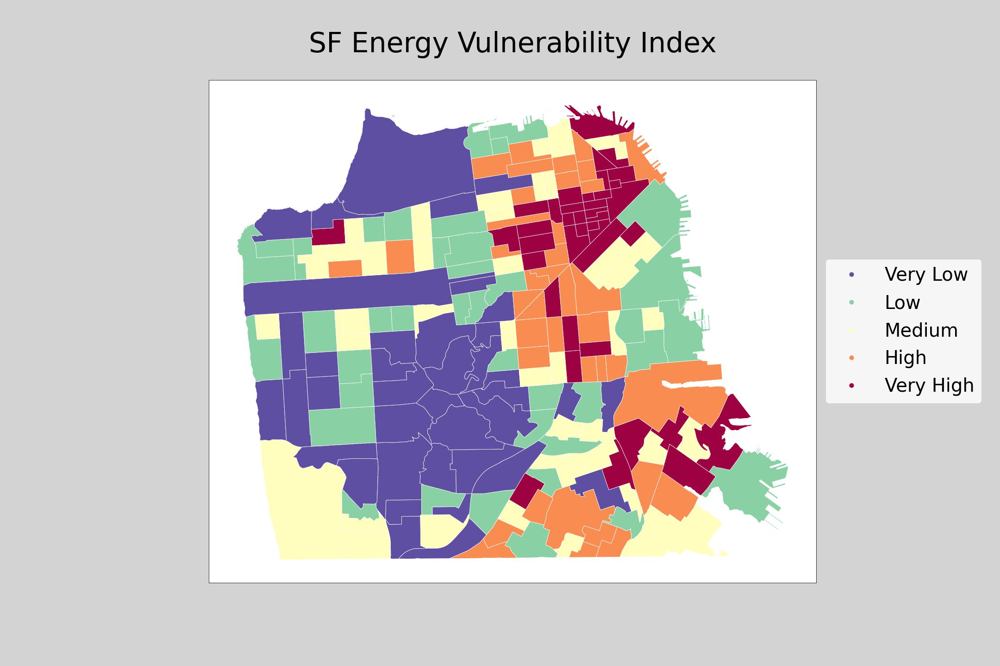

### Building an Energy Vulnerability Index for San Francisco

For my research proposal, I intend to develop an energy vulnerability index for San Francisco, and potentially other Bay Area cities such as Berkeley and/or Oakland, to evaluate the distribution of energy grid resilience and vulnerability across the city. Index construction will require multiple datasets as well as spatial and statistical manipulation of datasets in order to truly establish an effective metric by which to measure energy vulnerability.

Potential factors to include in the index are:

Energy consumption data (Source: Bay Area Regional Energy Network Energy Atlas)
Temperature and heat data (Source: USGS Landsat Raster Data for Air Surface Temperature)
Presence of tree canopy (Source: SF Urban Tree Canopy Vector Data)
Building age (Source: SF Land Use Parcel Data)
Proximity to healthcare facilities (SF Healthcare Facilities Point Data)
Median income - past 12 months (Source: 2019 ACS Data 5-Year Estimates)
Age (Source: 2019 ACS Data 5-Year Estimates)
Health Insurance (Source: 2019 ACS Data 5-Year Estimates)
As shown, each factor includes a data source. I will continue to workshop the dataset factors that construct the index in order to develop a well-balanced tool to assess energy vulnerability.

An energy vulnerability index will produce a spatial representation of community vulnerability to high energy prices and energy grid shutoffs and disconnections. It is well known that low-income families face a disproportionately higher energy burden – a denomination defined by the percentage of a household’s gross income spent on energy costs. According to the Department of Energy's Low-Income Energy Affordability Data Tool, the national average energy burden for low-income households is 8.6%, approximately three times higher than for non-low-income households. In some areas, depending on location and income, the energy burden can be as high as 30% of household gross income. Households with high energy burdens have also been found to be at greater risk for respiratory diseases, suffer from increased stress and economic hardship, and find it harder to escape poverty.

In addition, extreme heat can compound the effects of energy vulnerability for households. Heat waves and their impacts are well known to be distributed unevenly across several U.S. cities, including San Francisco. An analysis by the San Francisco Department of Public Health found that overburdened neighborhoods likely face the greatest challenges from heat waves, excess stress on the grid, and increased health vulnerabilities. Additionally, as the frequency of “extreme heat” days increases, those with high rates of power disconnection will face significant risk if they are unable to afford the costs of cooling. High demand for cooling to prevent health disasters from high heat exposure will further exacerbate energy cost burdens, an impact largely experienced by low-income communities.

The proposed research will incorporate multiple factors that influence energy vulnerability into one single index. A calculation through weighted analysis will create a single value for each census tract that demonstrates the tract's position on a scale of energy vulnerability. A final map will spatially visualize the data and demonstrate the distribution of energy vulnerability across the region(s) of study.



### Markdown

Markdown is a lightweight and easy-to-use syntax for styling your writing. It includes conventions for

```markdown
Syntax highlighted code block

# Header 1
## Header 2
### Header 3

- Bulleted
- List

1. Numbered
2. List

**Bold** and _Italic_ and `Code` text

[Link](url) and 
```

